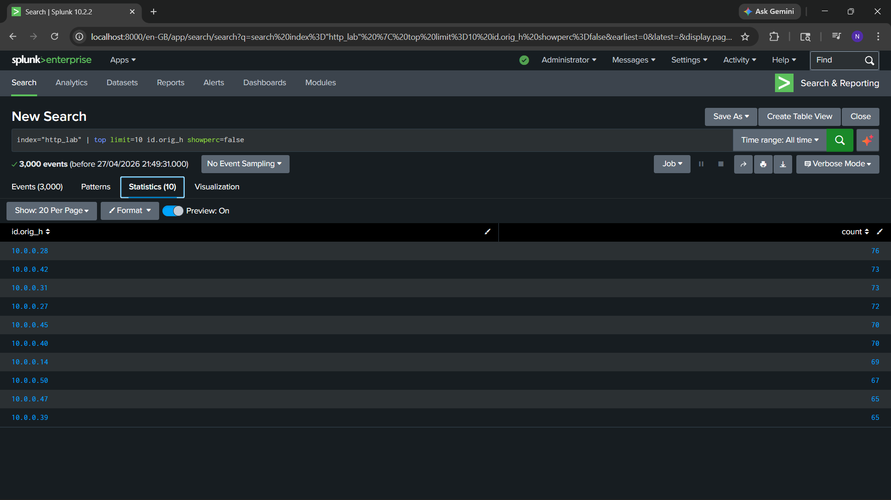
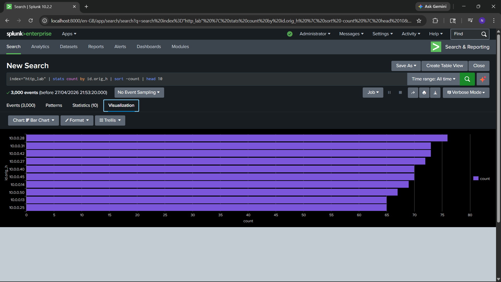
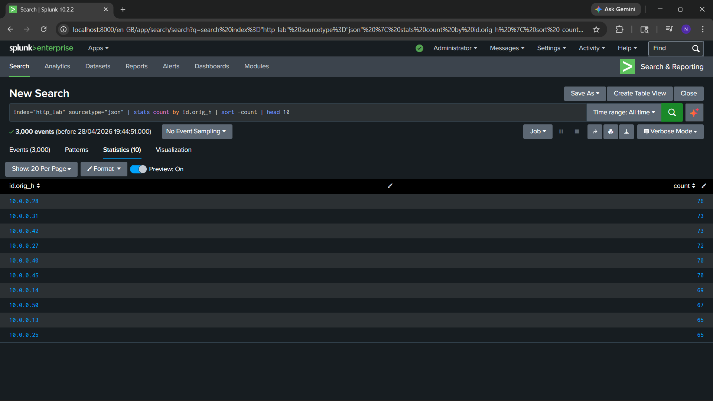
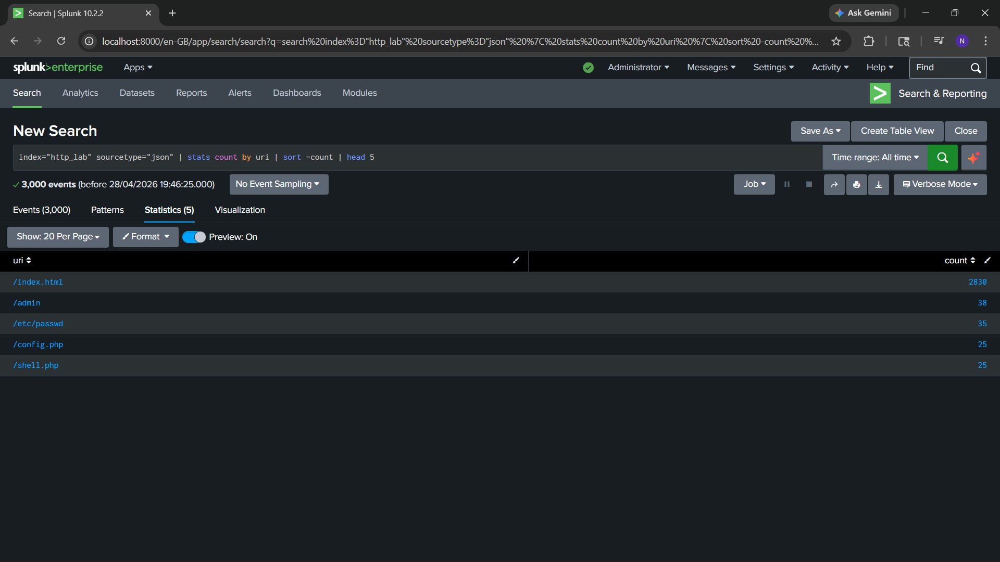
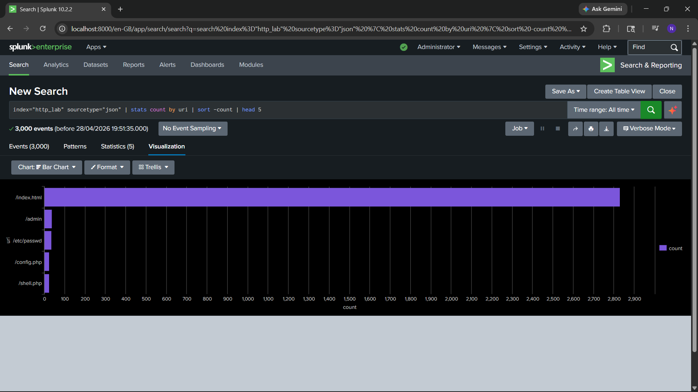
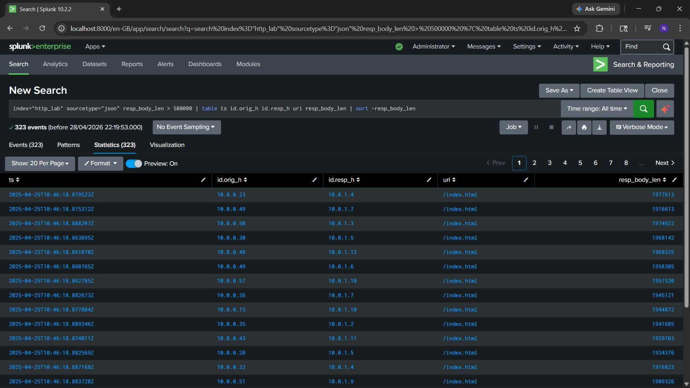
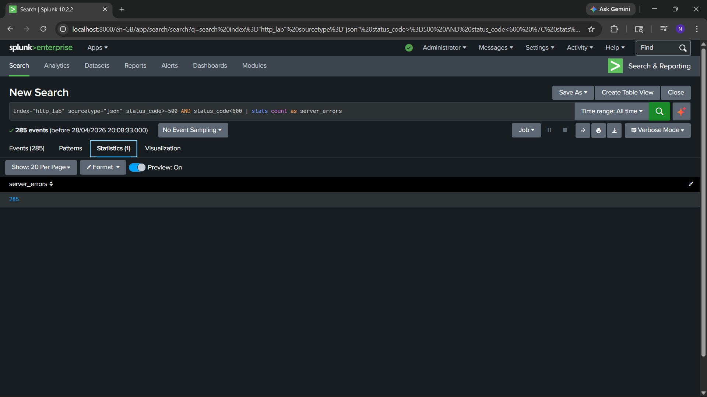
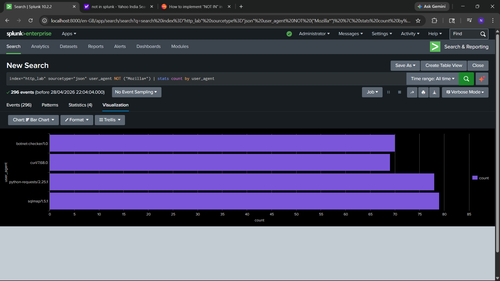

# Splunk SIEM — HTTP Log Analysis & Threat Detection

> Hands-on Splunk lab analysing 3,000 HTTP events to detect web application attacks, malicious automated tools, and suspicious traffic patterns using SPL queries and visualisations

---

## Table of Contents

- [Objective](#objective)
- [Tools & Environment](#tools--environment)
- [Dataset Overview](#dataset-overview)
- [Queries & Analysis](#queries--analysis)
- [Key Findings](#key-findings)
- [MITRE ATT&CK Mapping](#mitre-attck-mapping)
- [Screenshots](#screenshots)
- [Key Learnings](#key-learnings)

---

## Objective

Ingest and analyse HTTP web server logs in Splunk to:
- Identify top traffic sources and URI access patterns
- Detect malicious automated tools using user-agent analysis
- Flag sensitive path enumeration and web attack behaviour
- Identify abnormal server response sizes indicative of data exfiltration or exploitation
- Count server-side errors caused by malformed attack payloads
- Build visualisations to support security monitoring

---

## Tools & Environment

| Tool | Purpose |
|---|---|
| Splunk Enterprise 10.2.2 | SIEM platform — log ingestion, SPL queries, dashboards |
| Splunk Search & Reporting App | Query interface and visualisation |
| HTTP Lab Dataset (JSON) | Simulated web server logs (3,000 events) |
| SPL (Search Processing Language) | Query and analysis language |

**Index used:** `http_lab`  
**Sourcetype:** `json`  
**Total events analysed:** 3,000  
**Platform:** Localhost (Splunk Free tier)

---

## Dataset Overview

The dataset contains simulated HTTP web server logs in JSON format with the following key fields:

| Field | Description |
|---|---|
| `id.orig_h` | Source IP address (client/attacker) |
| `id.resp_h` | Destination IP address (server) |
| `uri` | URI path requested |
| `user_agent` | HTTP user-agent string |
| `status_code` | HTTP response status code |
| `resp_body_len` | Response body size in bytes |
| `ts` | Timestamp of the event |

---

## Queries & Analysis

### 1. Top 10 Source IPs by Request Volume

**Approach A — using `top` command:**
```spl
index="http_lab" 
| top limit=10 id.orig_h showperc=false
```

**Approach B — using `stats` with sort (more flexible):**
```spl
index="http_lab" sourcetype="json"
| stats count by id.orig_h
| sort -count
| head 10
```

**Why both approaches:** `top` is faster to write but less customisable. `stats + sort + head` gives full control over output fields, renaming, and chaining additional operations. In a real SOC, the `stats` approach is preferred for building alerts and dashboards.

**Result:** 10.0.0.28 was the highest-volume source IP with 76 requests, followed closely by 10.0.0.31 and 10.0.0.42 at 73 each. The distribution across IPs was relatively even (65–76 range), suggesting either distributed scanning or load-balanced traffic.

---

### 2. Top 5 Requested URIs

```spl
index="http_lab" sourcetype="json"
| stats count by uri
| sort -count
| head 5
```

**Result:**

| URI | Count | Significance |
|---|---|---|
| /index.html | 2,830 | Normal homepage traffic — dominates volume |
| /admin | 38 | Admin panel enumeration attempt |
| /etc/passwd | 35 | Linux path traversal — credential file access attempt |
| /config.php | 25 | Configuration file probing |
| /shell.php | 25 | Webshell access attempt |

The stark contrast between `/index.html` (2,830) and all other URIs (25–38) is itself a signal — attackers often blend attack traffic into normal-looking request patterns.

---

### 3. Large Response Bodies — Potential Data Exfiltration

```spl
index="http_lab" sourcetype="json" resp_body_len > 500000
| table ts id.orig_h id.resp_h uri resp_body_len
| sort -resp_body_len
```

**Result:** 323 events returned responses exceeding 500,000 bytes (~500KB). The largest responses were consistently to `/index.html`, with values ranging from ~1.9MB to ~1.97MB. Multiple distinct source IPs were generating these oversized responses, suggesting the server was returning unexpectedly large payloads — potentially a sign of data staging, misconfiguration being exploited, or application-level error pages containing verbose debug output.

---

### 4. Server-Side Error Count (5xx Status Codes)

```spl
index="http_lab" sourcetype="json" status_code>=500 AND status_code<600
| stats count as server_errors
```

**Result:** 285 server errors detected across the observation window. Server-side errors at this volume typically indicate application instability — in an attack context, these are commonly caused by malformed SQL injection payloads or path traversal attempts triggering unhandled exceptions in the application.

---

### 5. Non-Browser User-Agent Detection — Malicious Tool Identification

```spl
index="http_lab" sourcetype="json" user_agent NOT ("Mozilla*")
| stats count by user_agent
```

**Result:**

| User-Agent | Count | Assessment |
|---|---|---|
| botnet-checker/1.0 | ~75 | Explicitly malicious — botnet activity tool |
| curl/7.68.0 | ~70 | Scripted access — suspicious in this context |
| python-requests/2.25.1 | ~77 | Automated scripting — suspicious in this context |
| sqlmap/1.5.1 | ~78 | Confirmed malicious — SQL injection automation tool |

296 total events from non-browser user-agents. This is the highest-confidence finding in this analysis — `sqlmap` is a well-known open-source SQL injection framework used by attackers to automate database attacks. Its presence in web logs is unambiguous evidence of active exploitation attempts.

---

## Key Findings

### Finding 1 — Active SQL Injection Attack (Critical)

`sqlmap/1.5.1` was identified making 78+ requests against the web server. SQLmap is a dedicated SQL injection automation tool — its user-agent string appearing in production logs is a definitive indicator of an active web application attack. Combined with `botnet-checker/1.0`, `python-requests`, and `curl`, there were 296 automated non-browser requests in total, indicating coordinated tool-based scanning rather than manual browsing.

**Incident narrative:** An attacker (or automated scanner) is using SQLmap to probe the application for SQL injection vulnerabilities while simultaneously running botnet checks — a common combined reconnaissance pattern before a targeted attack.

### Finding 2 — Sensitive Path Enumeration (High)

Four high-risk URIs were repeatedly accessed outside of normal homepage traffic:

- `/etc/passwd` — 35 requests. This is a Linux system file containing user account information. Requesting this path via HTTP indicates a path traversal or directory traversal attempt, exploiting poor input validation to read files outside the web root
- `/shell.php` — 25 requests. Webshell access attempt. A webshell is a malicious script uploaded to a server that gives an attacker remote command execution capability
- `/config.php` — 25 requests. Attempting to read application configuration files, which often contain database credentials and API keys
- `/admin` — 38 requests. Admin panel enumeration — testing whether an exposed admin interface exists with default credentials

### Finding 3 — Server Errors Indicating Attack Impact (Medium)

285 HTTP 5xx errors detected. The volume of server-side errors aligns with the SQLmap activity — injection payloads frequently cause applications to crash or return unhandled exception errors, producing 5xx responses. This suggests the attack was actively triggering application instability rather than just probing passively.

### Finding 4 — Anomalous Response Sizes (Medium)

323 responses exceeded 500KB, with some reaching ~1.97MB — unusually large for a web server response. Oversized responses can indicate verbose error pages exposing stack traces (aiding attacker reconnaissance), successful data retrieval from injection attacks, or server misconfiguration returning debug output.

### Finding 5 — Distributed Source IPs with Concentrated Top Talker

10.0.0.28 generated the highest individual request volume (76 events) but the traffic was broadly distributed across ~10 source IPs in a relatively even band (65–76 requests each). This pattern is consistent with distributed scanning — either a botnet using multiple IPs to evade per-IP rate limiting, or a single attacker routing through multiple exit nodes.

---

## MITRE ATT&CK Mapping

| Finding | Tactic | Technique ID | Technique Name |
|---|---|---|---|
| SQLmap activity | Initial Access | T1190 | Exploit Public-Facing Application |
| /etc/passwd access | Discovery | T1083 | File and Directory Discovery |
| /shell.php access | Persistence | T1505.003 | Web Shell |
| /admin enumeration | Discovery | T1595.002 | Vulnerability Scanning |
| Automated scanning tools | Reconnaissance | T1595 | Active Scanning |
| Large response bodies | Exfiltration | T1030 | Data Transfer Size Limits |
| Non-browser user-agents | Defense Evasion | T1036 | Masquerading |

---

## Screenshots

### 1. Top 10 Source IPs — `top` Command

*10.0.0.28 highest-volume source IP (76 requests) across 3,000 events*

---

### 2. Top 10 Source IPs — `stats` Command

*Same result using `stats + sort + head` — preferred approach for chaining further SPL commands*

---

### 3. Top 10 Source IPs — Bar Chart

*Even distribution (65–76 requests/IP) consistent with distributed scanning behaviour*

---

### 4. Top 10 Source IPs — `sourcetype=json` Filter

*Sourcetype filter added — best practice to improve query performance*

---

### 5. Sensitive URI Enumeration — Table

*/etc/passwd (35), /shell.php (25), /config.php (25), /admin (38) — active path traversal and webshell access attempts detected*

---

### 6. Sensitive URI Enumeration — Bar Chart

*Malicious URIs blend into high-volume /index.html traffic (2,830 requests)*

---

### 7. Large Response Bodies — Potential Data Staging

*323 responses exceeding 500KB — responses up to ~1.97MB flagged as anomalous*

---

### 8. Server-Side Errors — 285 5xx Errors Detected

*285 5xx errors correlate with SQLmap payloads causing application crashes*

---

### 9. Malicious User-Agents Identified

*sqlmap/1.5.1, botnet-checker/1.0, python-requests, curl — 296 non-browser requests confirmed. High-confidence IOC*

---

## Key Learnings

**1. `top` vs `stats` — same result, different flexibility**  
Both `top limit=10 id.orig_h` and `stats count by id.orig_h | sort -count | head 10` produce the same output. `top` is a shortcut — useful for quick ad-hoc exploration. `stats + sort + head` is preferred in real SOC workflows because it supports chaining with `eval`, `where`, `eventstats`, and other commands for deeper analysis.

**2. Sourcetype filtering improves query performance and accuracy**  
Adding `sourcetype="json"` before the pipe significantly reduces the event scan scope. Always specify both `index` and `sourcetype` at the start of a query — this is the single most important SPL performance optimisation.

**3. User-agent analysis is a high-confidence detection method**  
Filtering out `Mozilla*` browser traffic and examining what remains is a fast, low-false-positive technique for identifying automated tools and scanners. Legitimate traffic is almost exclusively browser-based (Mozilla user-agent string). `sqlmap/1.5.1` appearing in logs is an unambiguous IOC requiring immediate escalation.

**4. URI patterns tell the attack story**  
The combination of `/etc/passwd`, `/shell.php`, `/config.php`, and `/admin` requests in the same dataset reveals a structured attack sequence — reconnaissance → webshell attempt → credential/config harvesting → admin access. Reading URI patterns together as a narrative (not just individual counts) is a core analyst skill.

**5. Response body size is an underused field**  
`resp_body_len` is often ignored in basic analysis but is valuable for detecting data staging (unusually large outbound responses) and verbose error pages. Filtering `resp_body_len > 500000` immediately surfaced 323 anomalous events — a simple but effective detection.

**6. 5xx errors as attack indicators**  
HTTP server errors are typically treated as infrastructure issues, not security signals. In this lab, 285 5xx errors correlated directly with SQLmap injection payloads causing application crashes — demonstrating that operational metrics can carry security signal when contextualised with other findings.

**7. Connecting findings across queries tells a richer story**  
No single query told the full picture. The attack narrative only emerged by combining: source IP volume → URI patterns → user-agent filtering → response size anomalies → error counts. This cross-query correlation is the core skill of SIEM analysis — individual queries are data points; the analyst's job is connecting them into a coherent incident timeline.

*Tools: Splunk Enterprise 10.2.2*
